# Отчет по практической работе №2
## Студент: Филиппов Даниил Викторович
## Группа: БСБО-16-23
## Дата выполнения: 28.03.26
### 1. Информация о кластере
#### 1.1 Статус Minikube

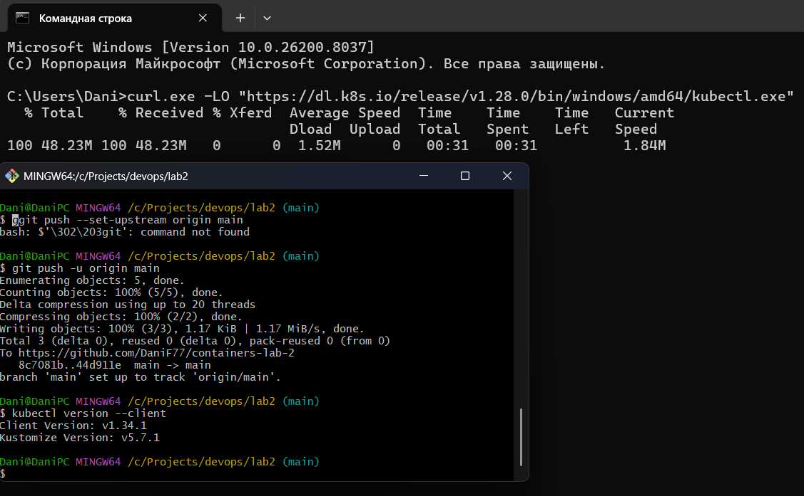

#### 1.2 Узлы кластера

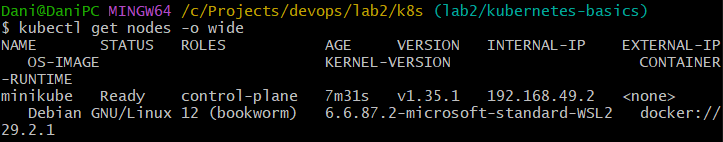

### 2. Созданные ресурсы
#### 2.1 Pods

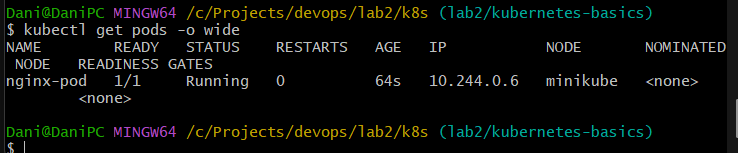

#### 2.2 Deployments

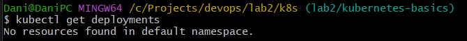
так как мы создали не deployment, а Pod напрямую

#### 2.3 Services

[вставьте вывод kubectl get services]
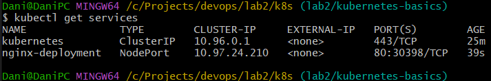
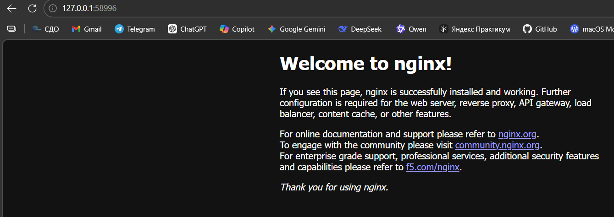

#### 2.4

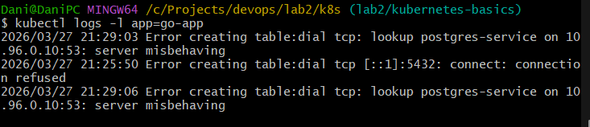

### 3. Скриншоты работы приложения
#### 3.1 Главная страница
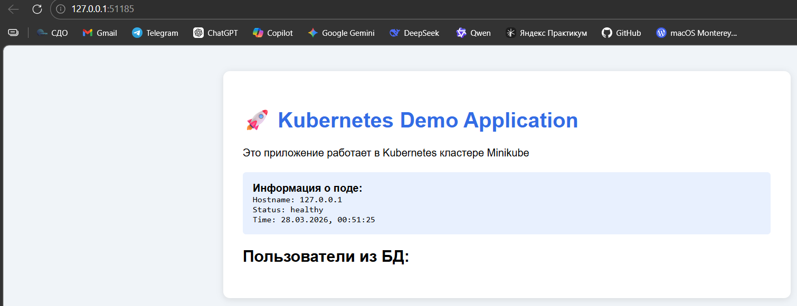
#### 3.2 Дашборд Kubernetes
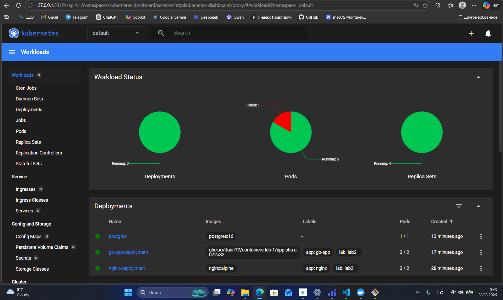
#### 3.3 Результат GET /api/users
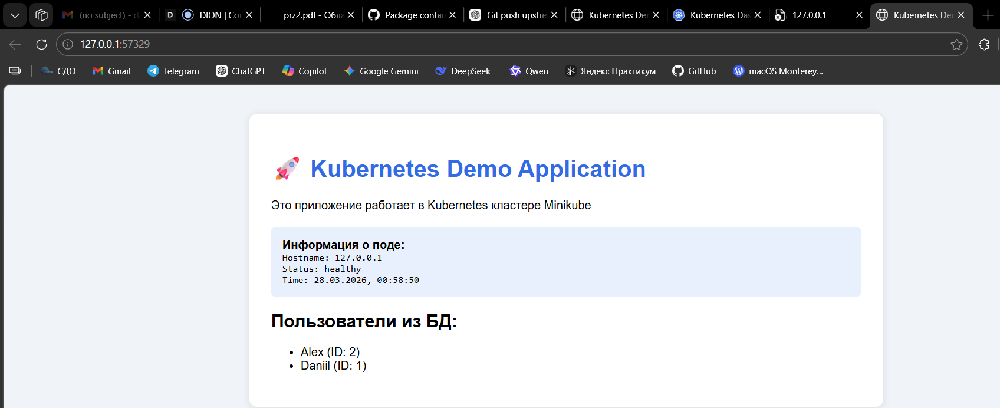
вывод пользователей
### 4. Эксперименты с масштабированием
#### 4.1 Масштабирование до 5 реплик

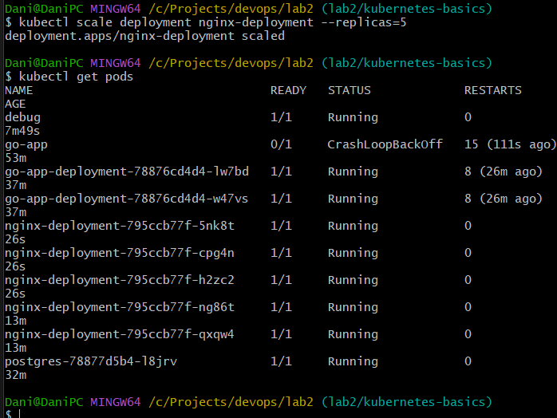

#### 4.2 Проверка распределения нагрузки

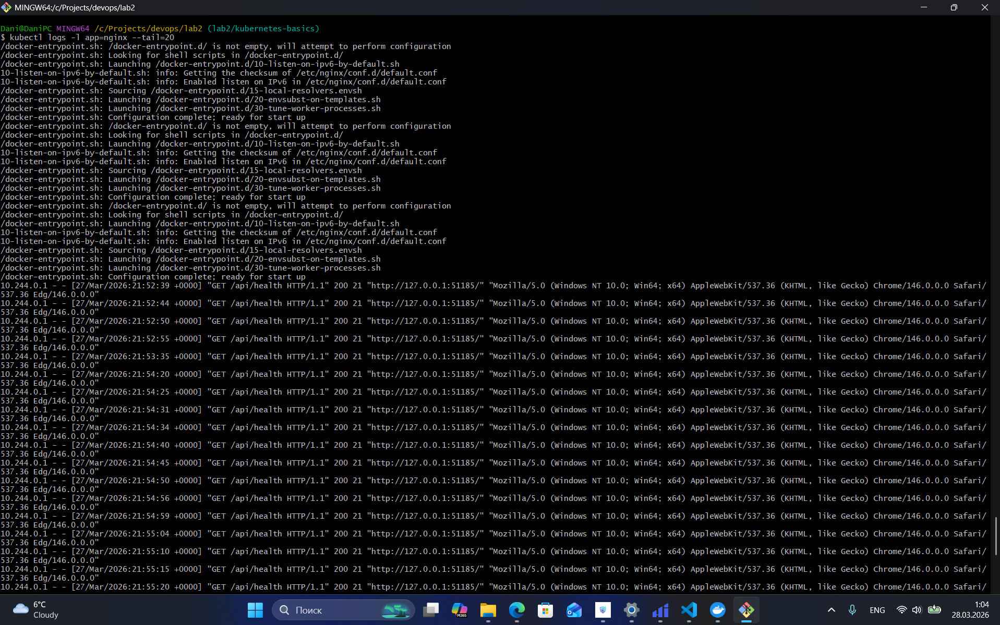

### 5. GitHub Actions
#### 5.1 Успешная валидация манифестов

### 6. Ответы на контрольные вопросы
1. В чем разница между Pod и Deployment?
Pod — это один (или несколько) контейнеров. Deployment — управляет Pod’ами: создаёт, обновляет и следит, чтобы нужное число работало.
2. Для чего нужен Service типа ClusterIP?
Даёт внутренний IP в кластере для доступа к Pod’ам между собой (внутренний балансировщик, снаружи недоступен).
3. Как ReplicaSet обеспечивает самовосстановление?
ReplicaSet следит за количеством Pod’ов. Если Pod падает/удаляется — он создаёт новый вместо него.
4. Что произойдет с приложением, если удалить под PostgreSQL?
ReplicaSet/Deployment поднимет новый Pod автоматически, данные сохранятся только если есть persistent volume, иначе могут потеряться.
### 7. Выводы
В ходе выполнения практической работы №2 были изучены базовые принципы оркестрации контейнеризованных приложений. Локальный кластер Minikube развернут согласно выданным методическим указаниям, требуемые YAML-манифесты созданы и применены без критических сбоев. Программа лабораторной работы выполнена в полном объеме, цели достигнуты.